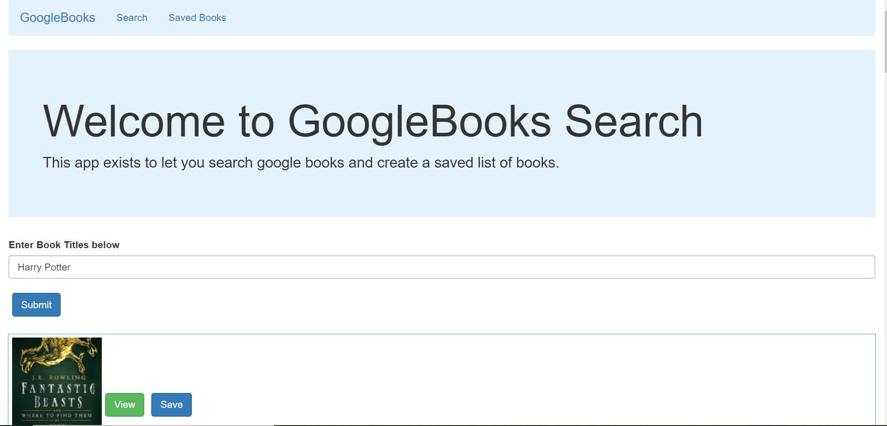

# Google Books
## Description
This app allows you to search for google books and save the in a list!

[Click here to live link](https://google-books-8675309.herokuapp.com/)

## Contributor
* mwturner611

## Technology
MongoDB, Mongoose, Node.js, Express, Heroku, React.js, JavaScript, HTML, CSS and Axios.

## Table of Contents
* [Top of Page](#description)
* [Technologies Used](#technology)
* [Usage](#how)
* [License](#license)
* [Contributing](#contributing)
* [Contacts](#contact)

## Picture

## How to use this code
1. Enter a title/author/description of a book you are interested in reading.
2. Look through the results.
3. Save or view more details of any resulting book.
4. Go to your "Saved Page" to view any books you've saved.

## License
This project is licensed under The MIT License (MIT).

## Contributing Guidelines
All contributions and suggestions are welcome! For direct contributions, please fork the repository and file a pull request.

## Contact
* Name: Matt Turner (@mwturner611)
* e-mail: mwturner611@gmail.com
* LinkedIn: https://www.linkedin.com/in/matt-turner-ba328211a/*